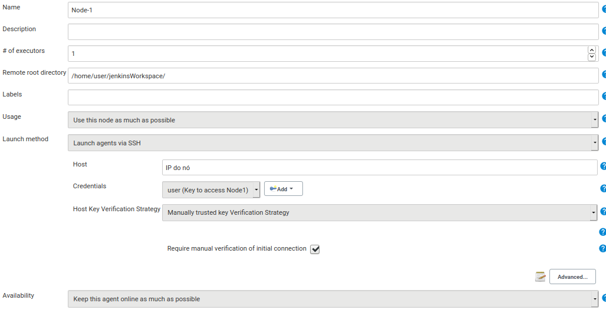
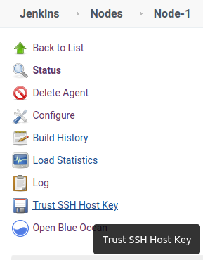
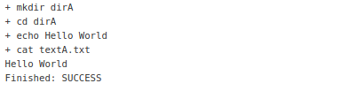
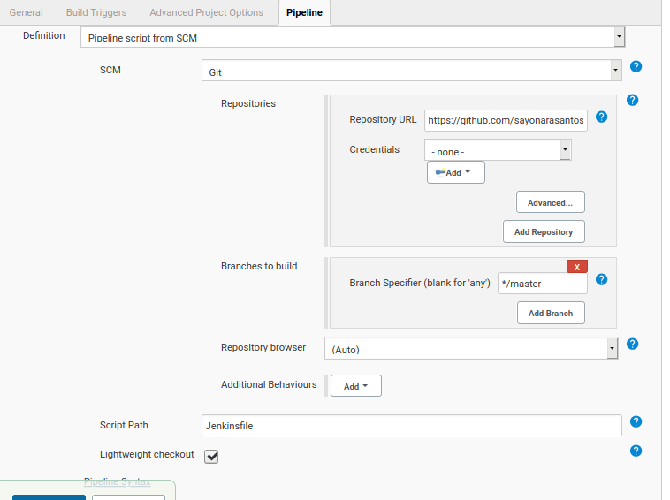
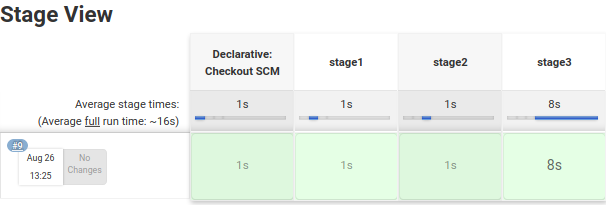
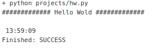

# jenkins_lab

**Descrição**

- Repositório para registrar algumas práticas com o Jenkins
- Jenkins é um software de automação, que viabiliza a integração contínua e a entrega contínua (CI/CD) de aplicações
- Versão da imagem utilizada neste projeto: [2.332](https://hub.docker.com/layers/jenkins/jenkins/2.332/images/sha256-c1cc7111afb1bc8f0d12a1d39e0ba3baee4ad054091cb599018366f44bdfe823?context=explore)


**Pré-requisitos**

- Docker e Docker Compose
- Git


**Sumário**

- [Instalação com Docker](#1-instalação-com-docker)
- [Configurações](#2-configurações)
    - [Configuração de nó Jenkins](#21-configuração-de-nó-jenkins)
    - [Configuração de serviço Webhook com o Jenkins em rede privada](#22-configuração-de-serviço-webhook-com-o-jenkins-em-rede-privada-apenas-para-estudo)
- [Alguns testes](#3-alguns-testes)
    - [Freesytle project com comandos Shell](#31-freesytle-project-com-comandos-shell)
    - [Pipeline](#32-pipeline)
    - [Freesytle project com gatilho GitHub](#33-freesytle-project-com-gatilho-github)
- [Extra](#extra)
- [Referências](#referências)


---

## 1. Instalação com Docker

Clone este repositório e suba o container do servidor Jenkins:

```console
git clone https://github.com/sayonarasantos/jenkins-lab.git
cd jenkins-lab/docker-config
docker-compose up -d --build
```

Verifique se o procedimento ocorreu corretamente:

```console
docker-compose ps
```

> Saída:
>
> Name &nbsp;&nbsp;&nbsp;&nbsp;&nbsp;&nbsp;&nbsp;&nbsp;&nbsp;&nbsp;&nbsp;&nbsp;&nbsp;&nbsp;&nbsp;&nbsp; Command &nbsp;&nbsp;&nbsp;&nbsp;&nbsp;&nbsp;&nbsp;&nbsp;&nbsp;&nbsp;&nbsp;&nbsp;&nbsp;&nbsp;&nbsp;&nbsp; State &nbsp;&nbsp;&nbsp;&nbsp;&nbsp;&nbsp;&nbsp;&nbsp;&nbsp;&nbsp;&nbsp;&nbsp;&nbsp;&nbsp;&nbsp;&nbsp; Ports
>
>--------------------------------------------------------------------------------------------------------------------------------------------------\
> jenkins &nbsp;&nbsp;&nbsp;&nbsp; /sbin/tini -- /usr/local/b ... &nbsp;&nbsp;&nbsp;&nbsp; Up &nbsp;&nbsp;&nbsp;&nbsp; 50000/tcp, 0.0.0.0:8080->8080/tcp,:::8080->8080/tcp
> 
Extraia a senha para acessar a interface web:

```console
docker exec jenkins cat /var/jenkins_home/secrets/initialAdminPassword
```

E acesse a interface pelo endereço http://localhost:8080/

Ao se conectar ao Jenkins, registre um novo usuário.

Obs.: Não precisa instalar os plugins sugeridos se você já possui o plugins.txt configurado com seus plugins desejados.


---

## 2. Configurações

### 2.1. Configuração de nó Jenkins

#### 2.1.1. Adicionar credencial SSH no servidor Jenkins para acessar um nó

1. Vá para "Jenkins > Manage Jenkins > Security > Manage Credentials"
2. Clique em "Global credentials" do store Jenkins e depois em clique em "Add Credentials"
    > Caminho: http://localhost:8080/credentials/store/system/domain/_/newCredentials
3. Crie uma chave com as seguintes configurações:
    - Kind: Selecione "SSH Username with private key"
    - Scope: selecione "Global"
    - ID: Digite um identificador ou deixe em branco, assim um novo ID será gerado
    - Description: Opcional
    - Username: Digite o usuário que tem acesso a máquina com a chave SSH que será utilizada
    - Private Key: Selecione "Enter directly"
        - Key: clique em "Add" e copie a chave privada
    - Passphrase: Digite a senha da chave

    Ao finalizar a configuração, clique em "OK"

#### 2.1.2. Adicionar o novo nó

1. Vá para "Jenkins > Manage Jenkins > System Configuration > Manage Nodes and Clouds"
2. Clique em "New Node"
3. Crie um nó com as seguintes configurações, depois clique me "OK":
    - Node name: Digite um identificador para o nó
    - Selecione "Permanent Agent"
4. Você será redirecionado à página de configuração do nó, então preencha o formulário:
    - Description: Opcional
    - Number of executors: Número de compilações que o nó poderá executar
    - Remote root ditectory: Digite o caminho do diretório onde será instalada a *workspace* do Jenkins no nó
    - Launch method: Selecione "Launch agents via SSH"
    - Host: Digite o endereço IP ou o Hostname do nó
    - Credentials: Selecione a chave SSH cadastrada (no tópico 2.1.1.)
    - Host Key Verification Strategy: Selecione "Manually trusted key verification strategy"
    - Selecione "Require manual verification of initial connection"

    

    Ao finalizar a configuração, clique em "Save"

#### 2.1.3. Iniciar acesso ao nó

1. Acesse o nó criado
    > Caminho: Jenkins > Manage Jenkins > System Configuration > Manage Nodes and Clouds > ID do nó
2. Habilite como confiável a identidade do host clicando em "Trust SSH host key" > "Yes"

    

3. Conecte-se ao nó clicando em "Launch Agent"
    > A página será redirecionado para o Log, e você deverá ver o trecho "Agent successfully connected and online", caso a conexão seja bem sucedida.
4. Agora você pode desconectar o nó clicando em "Disconnect"

### 2.2. Configuração de serviço Webhook com o Jenkins em rede privada (apenas para estudo)

#### 2.2.1. Configurar serviço de encaminhamento Webhook

Para configurar o gatilho de push través de Webhook do GitHub, você precisa ter um payload url para o GitHub postar as notificações de Push. O padrão do payload url do Jenkins é https://JENKINS_DOMAIN/github-webhook/.

Como realizei os experimentos deste projeto em rede privada, não tinha IP público para o serviço Jenkins. Então, utilizei um serviço de encaminhamento de Webhook, o [Smee.io](https://smee.io/). A seguir, estão os passos realizados para utilizar o serviço:
1. Gere um canal clicando em "Start a new channe" no site https://smee.io/. Isso lhe dará um URL exclusivo
2. Copie a url para ser usado posteriormente
3. O cliente smee já está configurado na imagem docker utilizada. Então basta executa o cliente no container

    ```console
    docker container exec -it jenkins_s bash
    smee -u https://URL_GENERATED_BY_SMEE --path /github-webhook/ --port 8080
    ```

    > Saída:
    >
    >Forwarding https://URL_GENERATED_BY_SMEE to http://127.0.0.1:8080/github-webhook/
    >
    >   Connected https://URL_GENERATED_BY_SMEE

    Obs.: Este último comando inicia o cliente smee e o aponta para o servidor Jenkins (executando na porta 8080). Para o canal entre o Github e o Jenkins permanecer funcionando, deixe o comando em execução.

#### 2.2.2. Adicionar Webhook no GitHub

_Palavras-chaves: [GitHub](https://plugins.jenkins.io/github/)_

Adicione um webhook no repositório Github da sua aplicação (Repositório > Settings > Webhooks) com a seguinte configuração:
- Payload URL: Cole o URL do Smee que você copiou na etapa acima (https://URL_GENERATED_BY_SMEE)
- Content type: Escolha o tipo de conteúdo application/json
- Which events would you like to trigger this webhook?: Selecione a opção para o webhook notificar apenas em eventos de push (Just the push event.)

Por fim, clique em "Add Webhook". Agora você já pode configurar um item no Jenkins para receber gatilhos de push do Github.


---

## 3. Alguns testes

### 3.1. Freesytle project com comandos Shell

_Palavras-chaves: Freesytle project - Shel script - SSH_

**Descrição**

Você irá criar um item Jenkins que executa uma sequência de comando em Shell em um nó.

**Passos**

1. Na página inicial do Jenkins, clique em "New item"
2. A página de criação será aberta automaticamente. Nessa página, dê um nome ao item, escolha o tipo "Freestyle project" e clique em "OK" no canto inferior da página
3. A página de configuração será aberta automaticamente. Nessa página, faça a seguinte configuração:
    - General
        - Selecione "Restrict where this project can be run"
        - Logo abaixo, em "Label Expression", procure pelo nome do nó e o selecione
    - Source Code Management
        - Selecione "None"
    - Build
        - Adicione um passo, clicando em "Add step build"
        - Clique em "Execute Shell" e escreva o script:
            ```shell
            mkdir dirA
            cd dirA
            echo "Hello World" > textA.txt
            cat textA.txt
            ```
4. Salve as configurações e, na página do item, clique em "Build Now"
5. Na mesma página, na seção "Build History", clique no número do build criado parar ver as saídas dele ("Console Output")

    

### 3.2. Pipeline

_Palavras-chaves: Pipeline - Python - [GitHub](https://plugins.jenkins.io/github/) - SSH_

**Descrição**

Você irá criar um item Jenkins para executar um conjunto de tarefas.

**Passos**

1. Na página inicial do Jenkins, clique em "New item"
2. A página de criação será aberta automaticamente. Nessa página, dê um nome ao item, escolha o tipo "Pipeline" e clique em "OK" no canto inferior da página
3. A página de configuração será aberta automaticamente. Nessa página, faça a seguinte configuração:
    - General
        - Selecione "GitHub project"
        - Logo abaixo, em "Project url", cole o endereço do repositório no GitHub
    - Pipeline
        - Definition: Selecione "Pipeline script from SCM"
            - SCM: Selecione "Git"
            - Repositories: endereço do repositório no GitHub
            - Branch Specifier: Digite o caminho do branch
            - Script Path: Digite o caminho do arquivo Jenkinsfile no repositório

        
    
    Ao finalizar a configuração, clique em "Save"

4. Na página do item, clique em "Build Now"
5. Na mesma página, na seção "Build History", clique no número do build criado parar ver as saídas dele ("Console Output")

    


### 3.3. Freesytle project com gatilho GitHub

_Palavras-chaves: Freesytle project - Shel script - Python - [Git](https://plugins.jenkins.io/git/) - [GitHub](https://plugins.jenkins.io/github/) - SSH_

**Descrição**

Você irá automatizar a realização de tarefa em um nó depois que ocorre um push em um repositório no GitHub.

**Passos**

1. Configure o Webhook no Github
2. Na página inicial do Jenkins, clique em "New item"
3. A página de criação que será aberta automaticamente. Nessa página, dê um nome ao item, escolha o tipo "Freestyle project" e clique em "OK" no canto inferior da página
4. A página de configuração será aberta automaticamente. Então, faça a seguinte configuração:
    - General
        - Selecione "Restrict where this project can be run"
        - Logo abaixo, em "Label Expression", procure pelo nome do nó e o selecione
    - Source Code Management
        - Selecione "Git"
            - Repositories: 
                - Repository URL: Endereço do repositório no GitHub
                - Credentials: Adicione as credenciais que tem acesso ao GitHub. No meu caso, adicionei um token (ver [Create a Personal Access Token in GitHub](https://www.digitalocean.com/community/tutorials/how-to-set-up-continuous-integration-pipelines-in-jenkins-on-ubuntu-16-04#create-a-personal-access-token-in-github))
            - Branches to build:
                - Branch Specifier: Digite o caminho do branch
    - Build Triggers
        - Selecione "GitHub hook trigger for GITScm polling"
    - Build:
        - Adicione um passo, clicando em "Add step build"
        - Clique em "Execute Shell"
        - Cole o seguinte código:
            ```shell
            python projects/1-python-pipeline/hw.py
            ```
5. Faça um push no repositório do GitHub
6. Na página do item Jenkins, na seção "Build History", clique no número do build criado parar ver as saídas dele ("Console Output")

    


---

## Extra

- Listar plugins instalador para criar o arquivo plugins.txt
    Na página http://0.0.0.0:8080/script, cole o seguinte script:
    ```groovy
    def plugins = jenkins.model.Jenkins.instance.getPluginManager().getPlugins()
    plugins.each {println "${it.getShortName()}: ${it.getVersion()}"}
    ```

    Clique em "Run" e copie a lista de plugins apresentadas no arquivo plugins.txt


---

## Referências

- Como instalar o Jenkins no Ubuntu 20.04. Disponível em: https://www.digitalocean.com/community/tutorials/how-to-install-jenkins-on-ubuntu-20-04-pt
- How to Connect to Remote SSH Agents?. Disponível em: https://support.cloudbees.com/hc/en-us/articles/222978868-How-to-Connect-to-Remote-SSH-Agents-
- Host Key Verification for SSH Agents. Disponível em: https://support.cloudbees.com/hc/en-us/articles/115000073552-Host-Key-Verification-for-SSH-Agents
- How To Set Up Continuous Integration Pipelines in Jenkins on Ubuntu 16.04. Disponível em: https://www.digitalocean.com/community/tutorials/how-to-set-up-continuous-integration-pipelines-in-jenkins-on-ubuntu-16-04#create-a-personal-access-token-in-github
- GitHub Permissions and API token Scopes for Jenkins. Disponível em: https://support.cloudbees.com/hc/en-us/articles/234710368-GitHub-Permissions-and-API-token-Scopes-for-Jenkins
- Triggering builds with webhooks behind a secure firewall. Disponível em: https://www.jenkins.io/blog/2019/01/07/webhook-firewalls/

