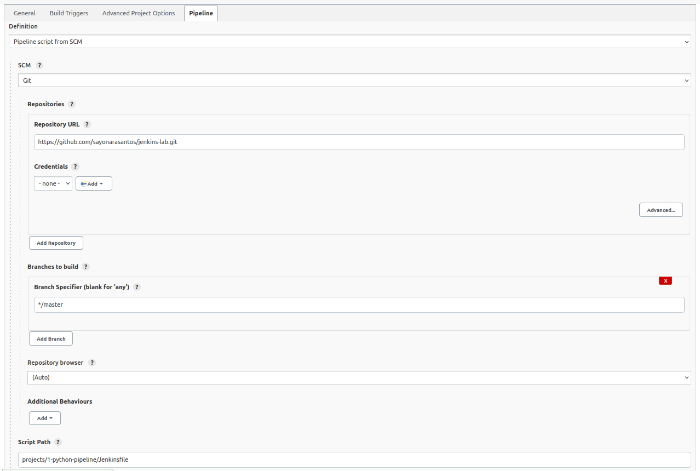

# jenkins_lab
## 1 Descrição
- Repositório para registrar algumas práticas com o Jenkins
- **Jenkins** é um software de automação, que viabiliza a integração contínua e a entrega contínua (CI/CD) de projetos
- Versão da imagem utilizada neste projeto: [2.235.4](https://hub.docker.com/layers/jenkins/jenkins/2.235.4/images/sha256-63af286d97cd125b7735e6dae7cb504956facf3be91c0d332f724ea528a74121?context=explore)

---

## 2 Instalação
Na instalação por docker-compose, suba o container da aplicação Jenkins:
```console
cd jenkins_lab/dockerJenkins
docker-compose up -d --build
```
Verifique se o procedimento ocorreu corretamente:
```console
docker ps
```
> Saída:
>
> CONTAINER ID&nbsp;&nbsp;&nbsp;&nbsp;&nbsp;&nbsp;&nbsp;&nbsp;IMAGE&nbsp;&nbsp;&nbsp;&nbsp;&nbsp;&nbsp;&nbsp;&nbsp;COMMAND&nbsp;&nbsp;&nbsp;&nbsp;&nbsp;&nbsp;&nbsp;&nbsp;CREATED&nbsp;&nbsp;&nbsp;&nbsp;&nbsp;&nbsp;&nbsp;&nbsp;STATUS&nbsp;&nbsp;&nbsp;&nbsp;&nbsp;&nbsp;&nbsp;&nbsp;PORTS&nbsp;&nbsp;&nbsp;&nbsp;&nbsp;&nbsp;&nbsp;&nbsp;NAMES
> 
> ****** &nbsp;&nbsp;&nbsp;&nbsp;jenkins/jenkins:2.235.4&nbsp;&nbsp;&nbsp;&nbsp;"/sbin/tini -- /usr/…"&nbsp;&nbsp;&nbsp;&nbsp;3 hours ago&nbsp;&nbsp;&nbsp;&nbsp;Up 3 hours&nbsp;&nbsp;&nbsp;&nbsp;0.0.0.0:8080->8080/tcp, 50000/tcp&nbsp;&nbsp;&nbsp;&nbsp;jenkins_s
> 
Extraia a senha para acessar a interface web:
```console
sudo cat jenkins_home/secrets/initialAdminPassword  
```
E acesse a interface pelo endereço http://localhost:8080/

Ao se conectar ao Jenkins, registre um novo usuário e instale os plugis sugeridos.

---

## 3 Configurações
### 3.1 Configuração de acesso a um nó via SSH
#### 3.1.1 Adicionar credencial SSH para acessar o nó
1. Vá para "Jenkins > Manage Jenkins > Security > Manage Credentials"
2. Clique em "Global credentials" da *store* Jenkins e depois em clique em "Add Credentials"
> Caminho: http://localhost:8080/credentials/store/system/domain/_/newCredentials
3. Crie uma chave com as seguintes configurações:
- Kind: Selecione "SSH Username with private key"
- Scope: selecione "Global"
- ID: Digite um identificador ou deixe em branco, assim um novo ID será gerado
- Description: Opcional
- Username: Digite o usuário que tem acesso a máquina com a chave SSH que será utilizada
- Private Key: Selecione "Enter directly"
    - Key: clique em "Add" e copie a chave privada
- Passphrase: Digite a senha da chave

    Ao finalizar a configuração, clique em "OK"

#### 3.1.2 Adicionar o novo nó
1. Vá para "Jenkins > Manage Jenkins > System Configuration > Manage Nodes and Clouds"
2. Clique em "New Node"
3. Crie um nó com as seguintes configurações, depois clique me "OK":
- Node name: Digite um identificador para o nó
- Selecione "Permanent Agent"
4. Você será redirecionado à página de configuração do nó, então preencha o formulário:
- Remote root ditectory: Digite o caminho do diretório onde será instalada a *workspace* do Jenkins
- Launch method: Selecione "Launch agents via SSH"
- Host: Digite o endereço IP do nó
- Credentials: Selecione a chave SSH cadastrada
- Host Key Verification Strategy: Selecione "Manually trusted key verification strategy"
- Selecione "Require manual verification of initial connection"

    

    Ao finalizar a configuração, clique em "Save"

#### 3.1.3 Iniciar acesso ao nó
1. Acesse o nó criado
> Caminho: Jenkins > Manage Jenkins > System Configuration > Manage Nodes and Clouds > ID do nó
2. Habilite como confiável a identidade do host clicando em "Trust SSH host key" > "Yes"

    

3. Conecte-se ao nó clicando em "Launch Agent"
> Em seguida, a página será redirecionado para o Log, e você deverá ver o trecho "Agent successfully connected and online", caso a conexão seja bem sucedida.
4. Agora você pode desconectar o nó clicando em "Disconnect"


### 3.2 Configuração de serviço Webhook com o Jenkins em rede privada
#### 3.2.1 Configurar serviço de encaminhamento Webhook
Para configurar o gatilho de push través de Webhook do GitHub, você precisa ter um payload url para o GitHub postar as notificações de Push. O padrão do payload url do Jenkins é https://JENKINS_DOMAIN/github-webhook/.

Como realizei os experimentos deste projeto em rede privada, não tinha IP público para o serviço Jenkins. Então, utilizei um serviço de encaminhamento de Webhook, o [Smee.io](https://smee.io/). A seguir, estão os passos realizados para utilizar o serviço:
1. Gere um canal clicando em "Start a new channe" no site https://smee.io/. Isso lhe dará um URL exclusivo
2. Copie a url para ser usado posteriormente
2. O cliente smee já está configurado na imagem docker utilizada. Então basta executa o cliente no container
    ```console
    docker container exec -it jenkins_s bash
    smee -u https://URL_GENERATED_BY_SMEE --path /github-webhook/ --port 8080
    ```
    > Este último comando inicia o cliente smee e o aponta para o servidor Jenkins (executando na porta 8080). Para o canal entre o Github e o Jenkins permanecer funcionando, deixe o comando em execução.
    >
    >
    > Saída:
    >
    >Forwarding https://URL_GENERATED_BY_SMEE to http://127.0.0.1:8080/github-webhook/
    >
    >   Connected https://URL_GENERATED_BY_SMEE

#### 3.2.2 Adicionar Webhook no GitHub
_([GitHub](https://plugins.jenkins.io/github/))_

Adicione um webhook do seu projeto do Github (Repositório do projeto > Settings > Webhooks) com a seguinte configuração
- Cole o URL “smee” que você copiou na etapa acima (https://URL_GENERATED_BY_SMEE)
- Escolha o tipo de conteúdo application/json
- Selecione para o webhook gerar gatilho para qualquer tipo de evento (Send me everything)
- Por fim, clique em "Add Webhook"

Agora você já pode configurar um projeto no Jenkins para receber gatilhos de push do Github.

---

## 4 Alguns testes
### 4.1 Executa comandos Shell em um nó
#### 4.1.1 Descrição

_(Freesytle project - Shel script - SSH)_

Depois de realizar o tópico 3.1, você pode criar um projeto que execute uma sequência de comando em Shell em um nó.

#### 4.1.2 Passos
1. Na página inicial do Jenkins, clique em "New item"
2. Na ṕágina de criação em será aberta automaticamente, dê um nome ao projeto e escolha o tipo "Freestyle project" e clique em "OK" no canto inferior da página
3. Na página de configuração em será aberta automaticamente, faça a seguinte configuração:
- General
    - Selecione "Restrict where this project can be run"
    - Logo abaixo, em "Label Expression", procure pelo nome do nó e o selecione
- Source Code Management
    - Selecione "None"
- Build
    - Adicione um passo, clicando em "Add step build"
    - Clique em "Execute Shell"
    - E escreva o script:
        ```shell
        mkdir dirA
        cd dirA
        echo "Hello World" > textA.txt
        cat textA.txt
        ```
4. Na página do projeto, clique em "Build Now"
5. Na mesma página, na seção "Build History", clique no build criado "#1"
6. Por fim, na página do build, clique em "Console Output" e verifique se os comandos em shell executaram corretamente

    


### 4.2 Executar um pipeline com Jenkinsfile
#### 4.2.1 Descrição

_(Pipeline - Python - [GitHub](https://plugins.jenkins.io/github/) - SSH)_

Depois de realizar o tópico 3.1, você pode criar um projeto para executar um pipeline.

#### 4.2.2 Passos
1. Na página inicial do Jenkins, clique em "New item"
2. Na ṕgina de criação em será aberta automaticamente, dê um nome ao projeto e escolha o tipo "Pipeline" e clique em "OK" no canto inferior da página
3. Na página de configuração em será aberta automaticamente, faça a seguinte configuração:
- General
    - Selecione "GitHub project"
    - Logo abaixo, em "Project url", cole o endereço do projeto no GitHub

    

- Pipeline
    - Definition: Selecione "Pipeline script from SCM"
        - SCM: Selecione "Git"
        - Repositories: endereço do projeto no GitHub
        - Branch Specifier: Digite o caminho do branch
        - Script Path: Digite o caminho do arquivo Jenkinsfile no repositório do projeto
    
    
    
    Ao finalizar a configuração, clique em "Save"

4. Na página do projeto, clique em "Build Now"
5. Na mesma página, na seção "Build History", clique no build criado "#1"
6. Por fim, na página do build, clique em "Console Output" e verifique se o pipeline corretamente. Você pode também verificar o Status do pipeline:

    


### 4.3 Executar trabalhos depois de um push
#### 4.3.1 Descrição
_(Freesytle project - Shel script - Python - [Git](https://plugins.jenkins.io/git/) - [GitHub](https://plugins.jenkins.io/github/) - SSH)_

Automatizar a realização de tarefas em um nó depois que ocorre um push em um projeto no GitHub.

#### 4.3.2 Passos
1. Configure o Webhook no Github (tópico 3.2.2)
2. Na página inicial do Jenkins, clique em "New item"
3. Na página de criação que será aberta automaticamente, dê um nome ao projeto e escolha o tipo "Freestyle project" e clique em "OK" no canto inferior da página
4. Na página de configuração que será aberta automaticamente, faça a seguinte configuração:
- General
    - Selecione "Restrict where this project can be run"
    - Logo abaixo, em "Label Expression", procure pelo nome do nó e o selecione
- Source Code Management
    - Selecione "Git"
        - Repositories: https://github.com/YOUR_USER/jenkins_lab.git
        - Credentials: Adicione as credenciais que tem acesso ao GitHub. No meu caso, adicionei um token (ver [Create a Personal Access Token in GitHub](https://www.digitalocean.com/community/tutorials/how-to-set-up-continuous-integration-pipelines-in-jenkins-on-ubuntu-16-04#create-a-personal-access-token-in-github))
        - Branch Specifier: */master
- Build Triggers
    - Selecione "GitHub hook trigger for GITScm polling"
- Build:
    - Adicione um passo, clicando em "Add step build"
    - Clique em "Execute Shell"
    - Cole o seguinte código:
        ```shell
        python projects/hw.py
        ```
5. Faça um push no repositório do GitHub
6. Execute o projeto em "Projeto > "Build now"
7. Verifique o log da execução em "Projeto > Número do build > Console Output"

    

---

## Referências
- Como instalar o Jenkins no Ubuntu 20.04. Disponível em: https://www.digitalocean.com/community/tutorials/how-to-install-jenkins-on-ubuntu-20-04-pt
- How to Connect to Remote SSH Agents?. Disponível em: https://support.cloudbees.com/hc/en-us/articles/222978868-How-to-Connect-to-Remote-SSH-Agents-
- Host Key Verification for SSH Agents. Disponível em: https://support.cloudbees.com/hc/en-us/articles/115000073552-Host-Key-Verification-for-SSH-Agents
- How To Set Up Continuous Integration Pipelines in Jenkins on Ubuntu 16.04. Disponível em: https://www.digitalocean.com/community/tutorials/how-to-set-up-continuous-integration-pipelines-in-jenkins-on-ubuntu-16-04#create-a-personal-access-token-in-github
- GitHub Permissions and API token Scopes for Jenkins. Disponível em: https://support.cloudbees.com/hc/en-us/articles/234710368-GitHub-Permissions-and-API-token-Scopes-for-Jenkins
- Triggering builds with webhooks behind a secure firewall. Disponível em: https://www.jenkins.io/blog/2019/01/07/webhook-firewalls/

